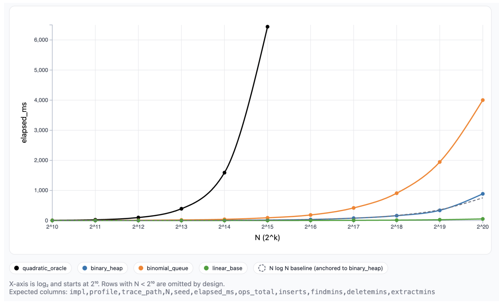

# Empirical Analysis of the Batch-then-Drain Profile

How do different priority queue implementations perform under the batch-then-drain workload? I
expected the binary heap and the binomial queues to be a lot more similar than what the final
results were of this benchmark because of the similarity they had of their functions and time
complexities.

## Method

We compared four priority queue implementations: the binary heap, binomial queue, the
quadratic oracle, and a linear baseline. The batch-then-drain profile inserts N values and then
removes them all one by one using deleteMin. The trace generator created random values for N
inserts and N deleteMin operations. The keys were generated with key_min being 1 and
key_max being 2^20 to create the smallest amount of duplicates for all the trace sizes. The
traces were generated using seed 23 for N values ranging from 2^10 to 2^20, with the same
ideas as the Huffman Profile generator. The harness performed one warmup run that was
untimed, and then it started the other trials and output a median of those runs for each N. The
quadratic oracle was timed only up to 2^15 to avoid the program running any longer than
necessary.

# Results

This plot shows the timing results for all four implementations. The binary heap was the fastest
across all the N values tested from N. It had better performance than the binomial queue by
four times at the largest N values given. The linear baseline that performs O(1) operations
showed the minimum overhead of N operations, and the quadratic oracle showed us the O(N^2)
growth.

## Takeaway: 
The binary heap consistently outperformed the binomial queue with all the tested sizes from these traces, showing that constant factors really do impact the real world
performance of these data structures.

## Interpretation

The Binary Heap performed the best with O(N log N) in the end results because of the
operations it was capable of such as O(log N) for the inserts and deleteMin functions, and it held
up to those expectations of being the fastest in this scenario. The Binomial queue has an
amortized case where insert can be O(1) but the worst case of insert would be O(log N) as well
as the deleteMin, but the binomial queue was almost four times slower than the binary heap in
the findings of this project. Both the linear baseline and quadratic oracle held up to their
expectations as well, where the oracle should be the worst and slowest because it's not made
for large data structures, and the linear baseline should show the minimum time on the graph.
Binary heap is faster than binomial queues because of how they store the data they are given.
The binary heap uses an array where all the data sits in one contiguous line of memory that
allows this benchmark to find and remove the smallest item the fastest. Binomial queues use
pointers that jump around in memory making it a lot harder to find the data when called by the
functions. Even though both have the same Big-O notation, the binary heap came out on top
because of the way its data is organized.

The linear baseline shows the minimum time just to run basic operations with no real work and
the quadratic oracle blows up after it hits a certain amount of values because each deleteMin
has to scan through remaining elements to find the minimum, which doesn't work well for data
sets that get too large.
With all of this taken in, this proves that how you arrange your data matters a lot in these types
of scenarios, and it's not just the algorithm itself.

